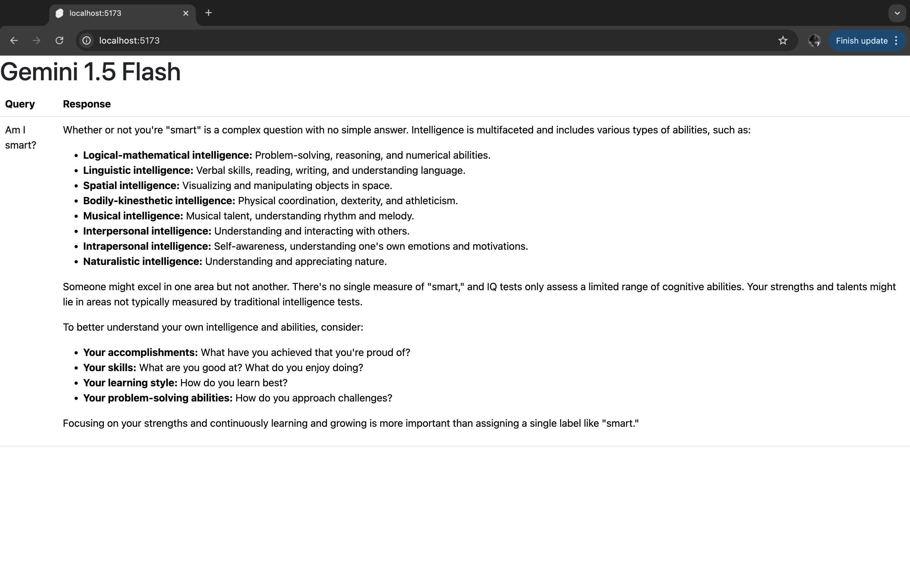

# Learning Svelte

## Apps

- [My First Svelte App (Gemini)](./gemini)

## References

- [Tutorial](https://svelte.dev/tutorial/svelte/welcome-to-svelte)
- [Creating a project](https://svelte.dev/docs/kit/creating-a-project)
- [Static Site Deployment](https://svelte.dev/docs/kit/adapter-static)
- [Building an app](https://svelte.dev/docs/kit/building-your-app)
- [Sveltestrap](https://sveltestrap.js.org/)
- [Slelte](https://threlte.xyz/)
