# SvelteKit and AI

I use SvelteKit with GenAI at work for Personalized CX. This project is to study each aspect of GenAI.

## Apps

### MCP

The SvelteKit server acts as an MCP host client, connecting to a local MCP server via STDIO.

```
                             [Goole Gemini]
                                   |
                                  REST
                                   |
[McpServer.js]---STDIO---[SvelteKit backend]---REST---[SvelteKit frontend]

```

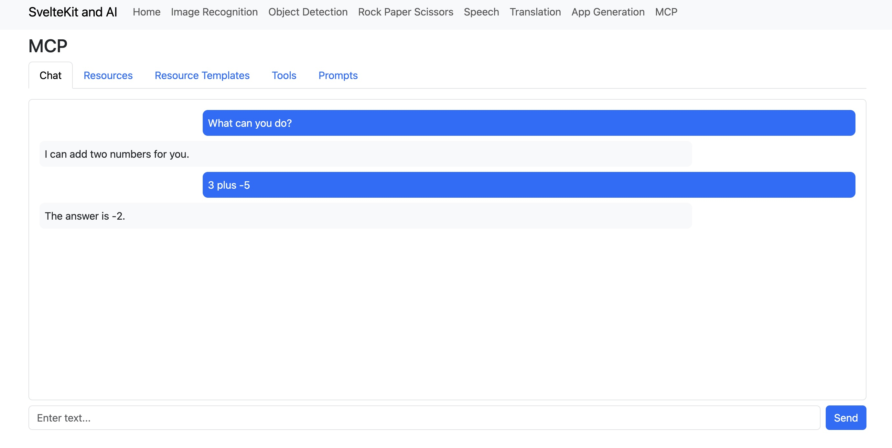

### App Generation
Generates a single-page data visualization app based on user instructions and data.

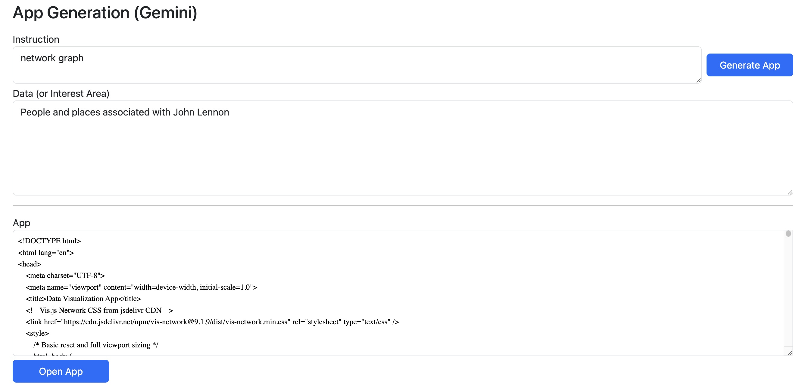

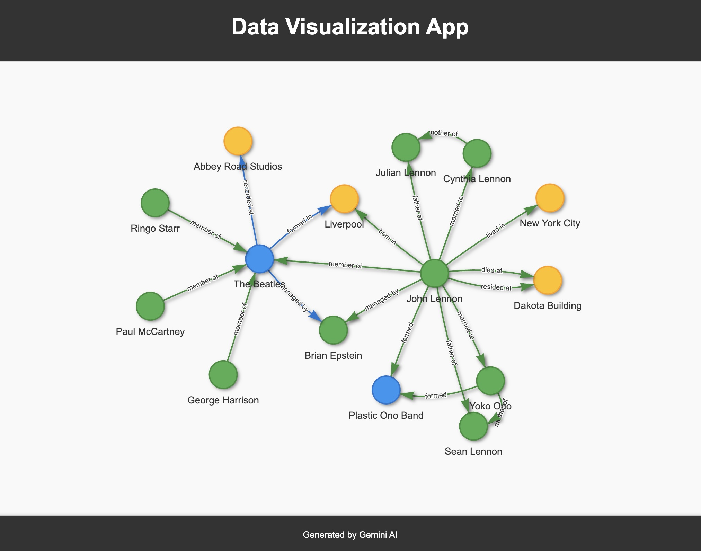

### Image Recognition
Identifies the main subject of an image using either Gemini or TensorFlow.js.

#### Gemini
Sends the image to the Gemini API for recognition.


#### TensorFlow.js mobilenet
Uses a pre-trained model (mobilenet) to classify images locally in the browser.

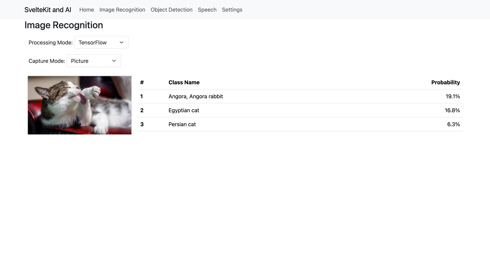

### Object Detection
Detects multiple objects in an image and provides bounding boxes.

#### Gemini
Detects objects by sending the image to the Gemini API.

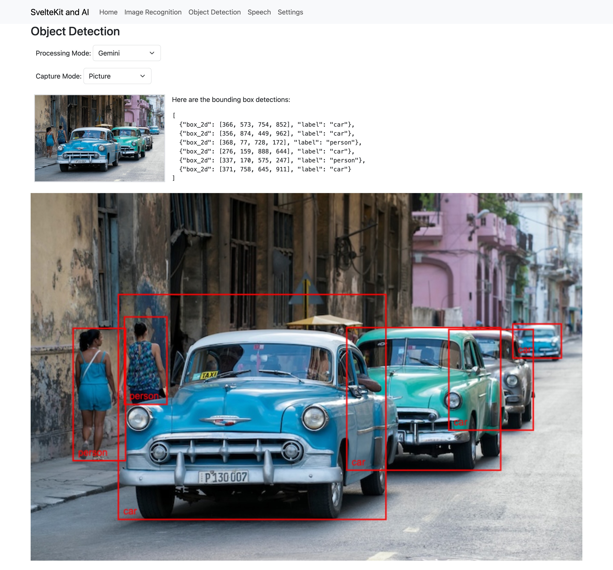

#### TensorFlow.js coco-ssd
Uses a pre-trained model (coco-ssd) for object detection in the browser.

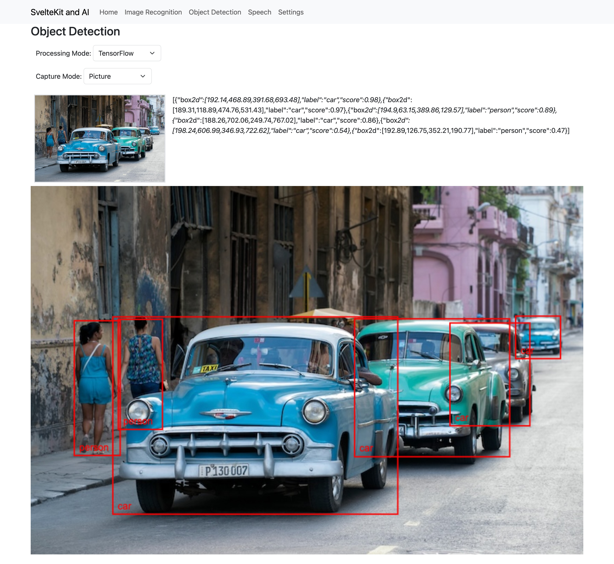

### Object Detection (Webcam capture)
Performs real-time object detection on a webcam stream.

#### Gemini
Captures a frame from the webcam and sends it to the Gemini API for object detection.

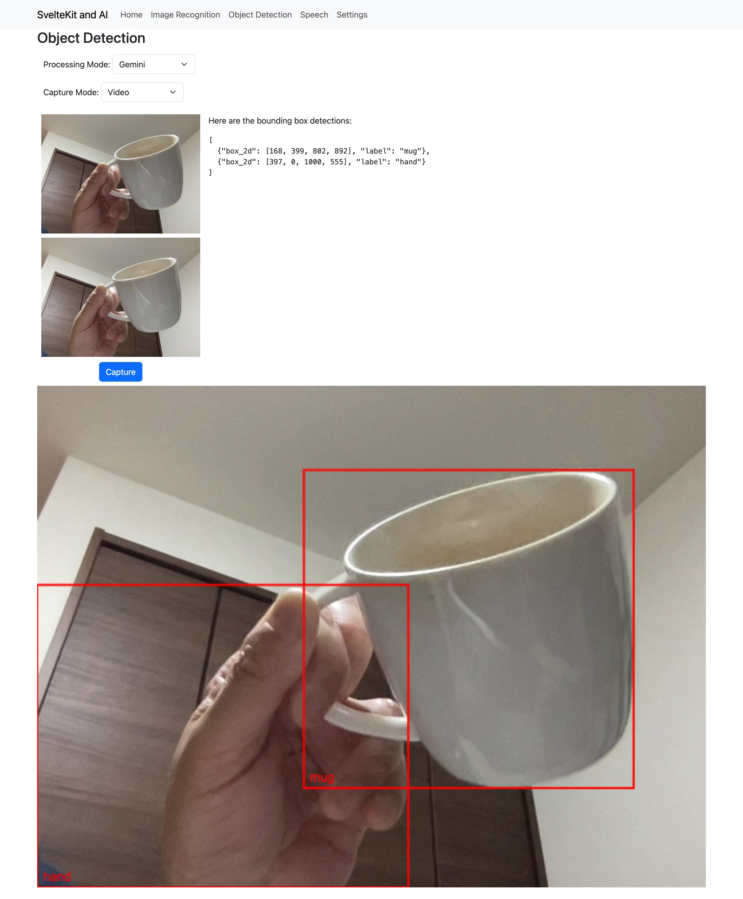

#### TensorFlow.js coco-ssd
Performs real-time object detection on the webcam stream using the coco-ssd model.

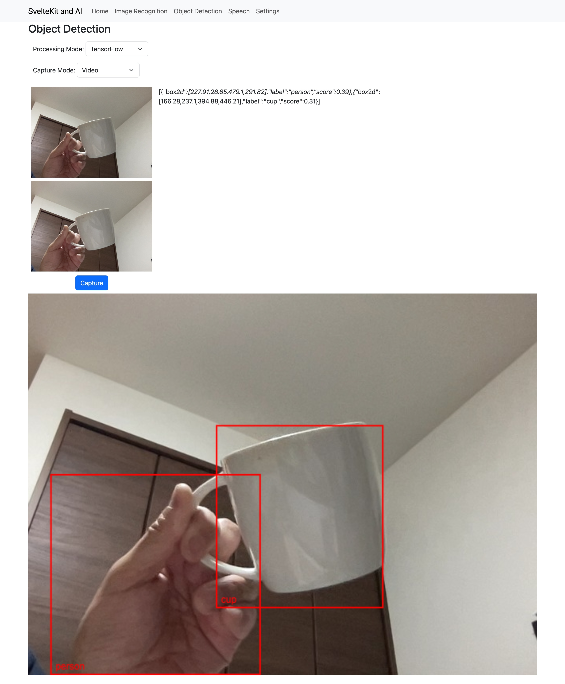

### Text to Speech
Converts text to speech with a choice of voices and emotions.

#### OpenAI gpt-4o-mini-tts
This UI allows you to select voice and emotion.

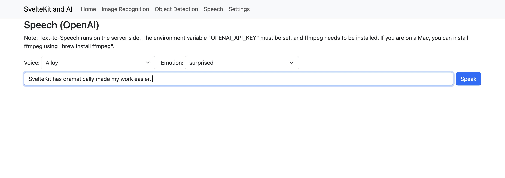

### Translation
Translates text from one language to another.

#### Gemini

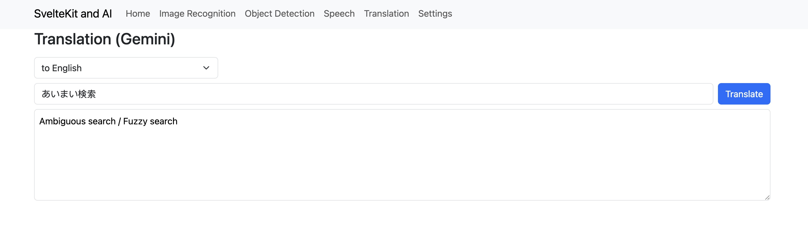

### Game
A classic game played against the computer.

#### Rock Paper Scissors

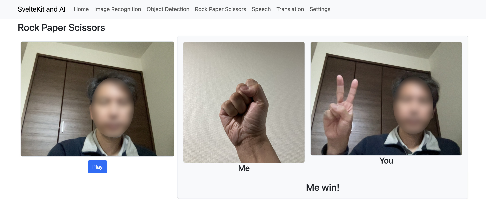


## Prerequisites

This app requires the `GEMINI_API_KEY` environment variable to be set. The `OPENAI_API_KEY` is optional and only required for the Text to Speech feature.

## Running the app

To run the app in the development environment,
```
$ cd app
$ npm run dev
```

To build and run the app,
```
$ cd app
$ npm run build
$ cd build
$ node index.js
```

## References

### SvelteKit
- [Tutorial](https://svelte.dev/tutorial/kit/introducing-sveltekit)
- [Creating a project](https://svelte.dev/docs/kit/creating-a-project)
- [Node Servers](https://svelte.dev/docs/kit/adapter-node)
- [Building an app](https://svelte.dev/docs/kit/building-your-app)

### Bootstrap
- [Bootstrap 5.3](https://getbootstrap.com/docs/5.3/getting-started/introduction/)

### Gemini
- [Text Generation](https://ai.google.dev/gemini-api/docs/text-generation)
- [Working with MCP](https://ai.google.dev/gemini-api/docs/function-calling?hl=ja&example=weather)

### TensorFlow
- [TensorFlow.js](https://www.tensorflow.org/js)

### OpenAI
- [Text to Speech](https://platform.openai.com/docs/guides/text-to-speech?lang=javascript)
