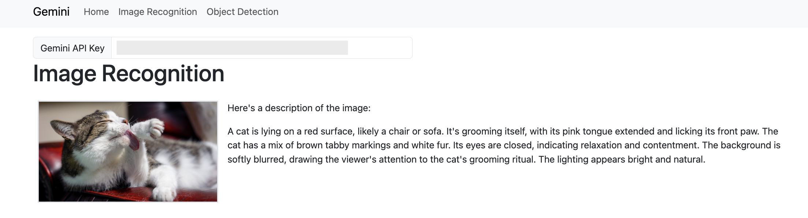
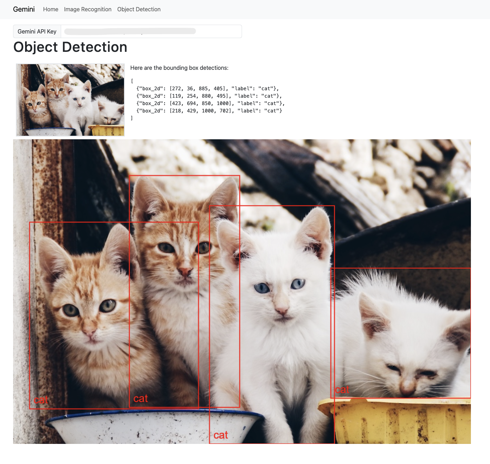

# Learning SvelteKit with Gemini and TensorFlow

I've been building a generative AI app at work with Vanilla JS, but the code's getting really bloated and hard to manage. So, I've started learning SvelteKit to fix that. SvelteKit looks like the easiest JavaScript framework to pick up, so I'm going to learn it.

## Apps

- [Svelte App with Gemini and TensorFlow](./gemini)
  - ["DropImage" custom element](./gemini/src/lib/DropImage.svelte)
  - ["MessageModal" custom element](./gemini/src/lib/MessageModal.svelte)

## References

- [Tutorial](https://svelte.dev/tutorial/kit/introducing-sveltekit)
- [Creating a project](https://svelte.dev/docs/kit/creating-a-project)
- [Static Site Deployment](https://svelte.dev/docs/kit/adapter-static)
- [Building an app](https://svelte.dev/docs/kit/building-your-app)
- [TensorFlow.js](https://www.tensorflow.org/js/models?hl=ja)
