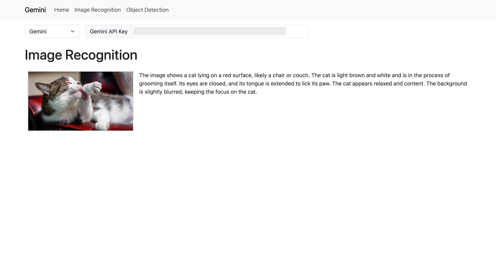
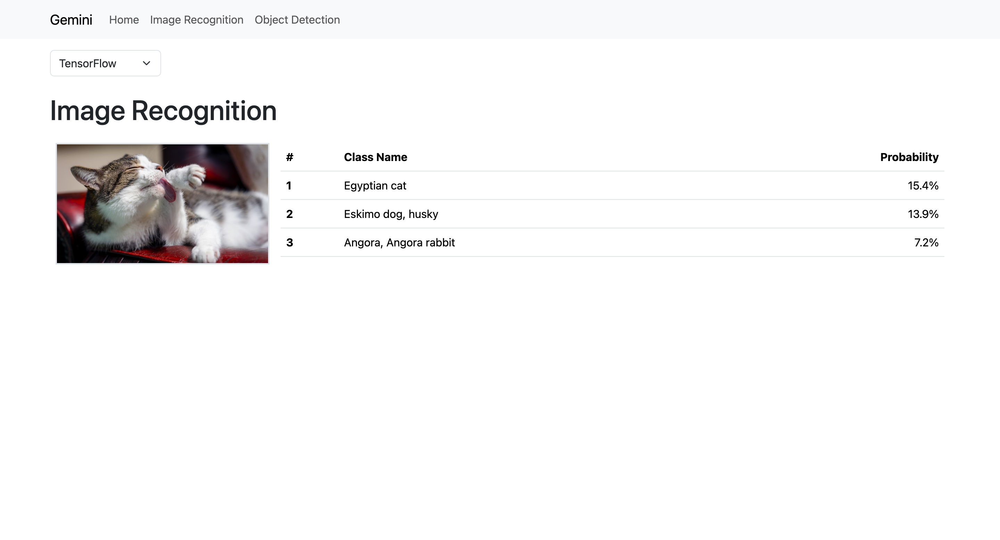
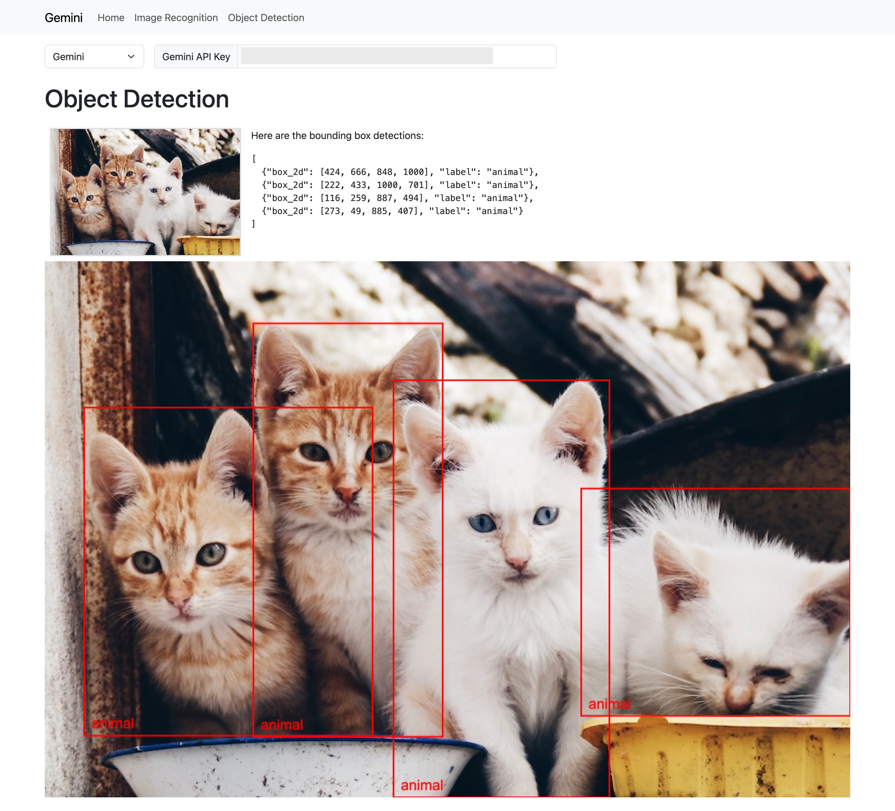
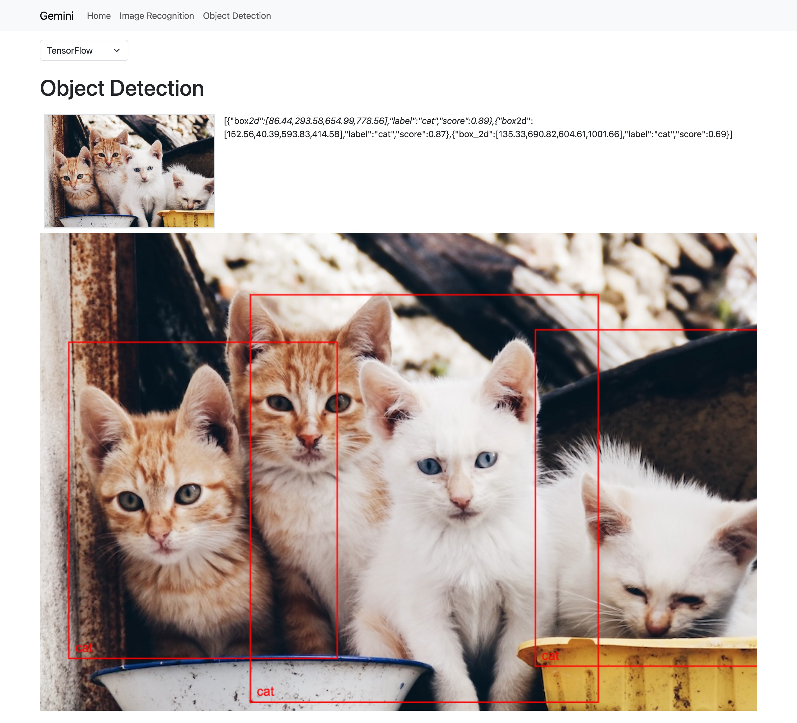

# SvelteKit and AI

Learn SvelteKit by doing with AI.

## App

### Image Recognition

#### Gemini 2.0 Flash



#### TensorFlow.js mobilenet



### Object Detection

#### Gemini 2.0 Flash



#### TensorFlow.js coco-ssd



## Code

To run the app in the development environment,
```
$ cd app
$ npm run dev
```

To build and run the app,
```
$ cd app
$ npm run build
$ cd build
$ node index.js
```

## References

### SvelteKit
- [Tutorial](https://svelte.dev/tutorial/kit/introducing-sveltekit)
- [Creating a project](https://svelte.dev/docs/kit/creating-a-project)
- [Node Servers](https://svelte.dev/docs/kit/adapter-node)
- [Building an app](https://svelte.dev/docs/kit/building-your-app)

### TensorFlow
- [TensorFlow.js](https://www.tensorflow.org/js)

### OpenAI
- [TTS](https://platform.openai.com/docs/guides/text-to-speech?lang=javascript)
